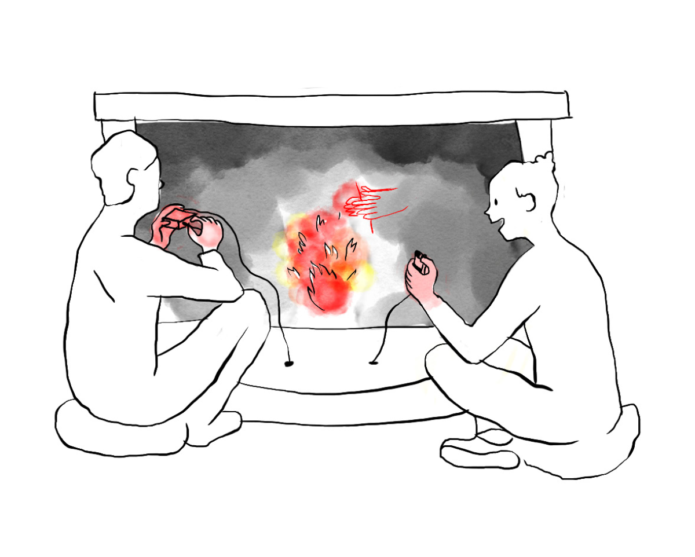
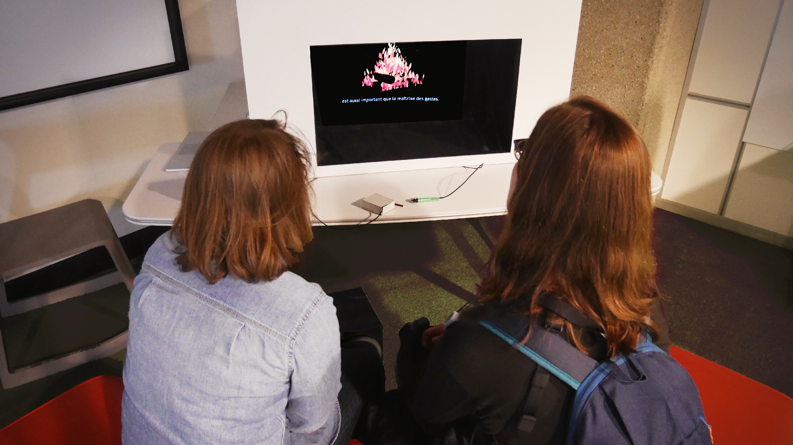
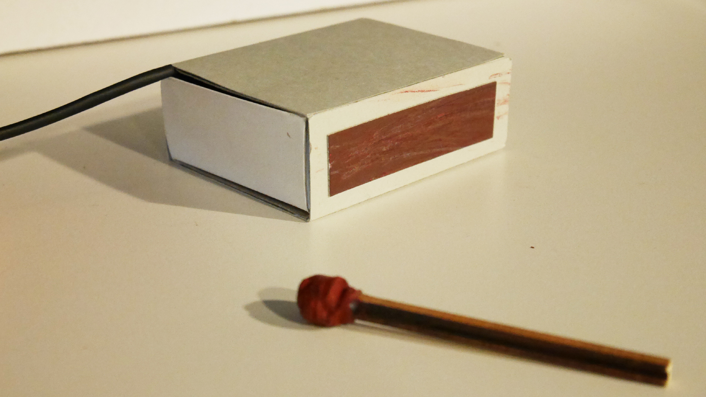
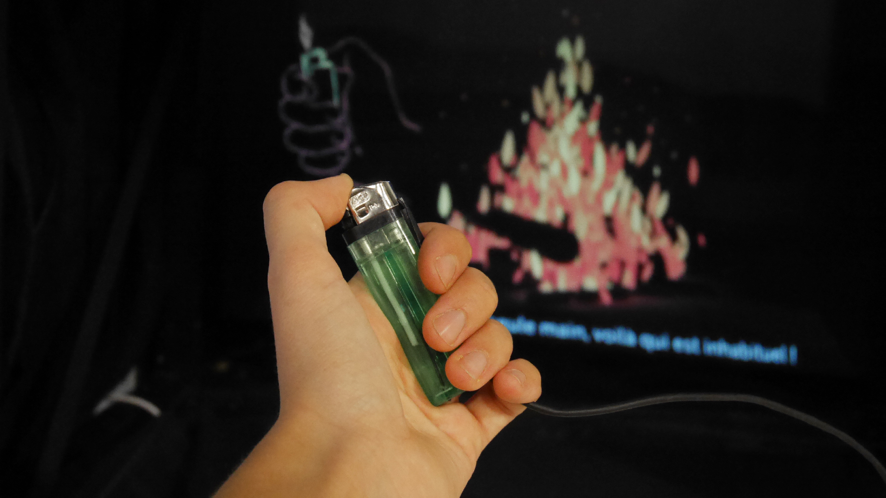

<!-- Main -->

<!-- One -->
<section id="one">
	

		<header class="major">
			<h1>Au coin du feu</h1>
		</header>
		<ol>
			<li><a href="#objectifs">Objectifs</a></li>
			<li><a href="#principe">Principe</a></li>
			<li><a href="#dispositif">Dispositif</a></li>
			<li><a href="#scenario">Scénario</a></li>
			<li><a href="#fabrication">Fabrication</a></li>
			<li><a href="#test">Test public</a></li>
		</ol>

<!-- Content -->
<h2 id="objectifs">Objectifs</h2>

« Au coin du feu » est une installation qui a pour but de révéler l’évolution d’un geste au fil de l’histoire des techniques.

<h2 id="principe">Principe</h2>

Aujourd’hui, nous pouvons faire du feu grâce à de petits gestes : activer un briquet ou craquer une allumette par exemple. Cette simplicité est le résultat d’un évolution des techniques, puisqu’au cours de l’histoire, les objets ont été perfectionnés pour épargner nos efforts physiques. Mais nos gestes si simples d’aujourd’hui sont issus d’une multitude de gestes utilisés par nos ancêtres avec leurs propres technologies.

Avec « Au coin du feu », reproduisez vos gestes quotidiens pour allumer du feu. À la lueur de celui-ci, découvrez la généalogie de vos gestes dans cette activité primordiale pour le développement de l’humanité : la maîtrise du feu.

<h2 id="dispositif">Dispositif</h2>

Au coin du feu se compose d’une boîte en bois ouverte sur un côté, d’un écran d’ordinateur, d’une plaque de Plexiglas, d’un briquet, d’une boîte d’allumette, d’un ordinateur et d’un kit Makey Makey. Trois vidéos ont été mis au point: une pour les moments de veille, une pour l'évolution du feu par percussion et une pour celle du feu par friction. Pour ces vidéos, ont été réalisé rédactionnels, animation, voix-off, sound design, sous-titrage.

<h2 id="scenario">Scénario</h2>

Les visiteurs se trouvent devant une cheminée. Dans l’âtre se trouve l’hologramme d’un feu éteint, dont l’éclairage varie comme s’il était en veille. Devant l’âtre se situe deux objets reliés à la cheminée, un briquet et une boîte d’allumette.

Assis sur une banquette devant le feu, le visiteur peut choisir soit de déclencher le feu par un des deux objets en reproduisant des gestes quotidiens : activer le briquet ou craquer une allumette. Le feu s’allume alors et raconte l’histoire des gestes liés à l’évolution technique de l’objet choisi : celle du feu à percussion pour le briquet et celle du feu par friction pour l’allumette.

<h2 id="fabrication">Fabrication</h2>
<h3>La cheminée</h3>

La cheminée est constituée d’une cage en tasseaux de bois, fermée sur trois côtés par des revêtements en médium très fins qui la dépasse en hauteur. Au-dessus, pour fermer la boîte, se trouve l’écran d’ordinateur retourné, ses rebords tenus par les bords de la cage, et la vitre de l’écran dirigée vers le sol. Pour finir, une plaque de Plexiglas est posée en diagonal à l’intérieur de la boîte.

<h3>La boîte d’allumette</h3>

Les parties rouges des côtés de la boîte sont recouvertes de papier à poncer pour mimer leur effet dans risquer de produire une flamme. À l’intérieur de la boîte est placé commutateur relié de part et d’autre par des à un kit Makey Makey. Un aimant est collé à petit bout de bois et recouvert de peinture rouge pour simuler une allumette. Ainsi, en passant l’allumette près du commutateur, le circuit se ferme et envoie un signal à travers le Makey Makey.

<h3>Le briquet</h3>

Un briquet à gaz est démonté. On y place un bouton sous le bouton poussoir. Le bouton est relié de part et d’autres au kit Makey Makeypar des fils. On perce la base du briquet pour faire passer ces fils et on remonte le briquet à gaz.

<h3>L'ordinateur</h3>

Le Makey Makey, envoie pour chacun des dispositifs une lettre du clavier. Sur le logiciel Resolume, on mappe le déclenchement des vidéos selon la lettre du clavier envoyé. Relier l’écran à l’ordinateur et mettez l’output de Resolume en plein écran.

<h2 id="test">Test</h2>

Nous avons testé ce dispositif à la Cité des Sciences le 19 mai 2019 avec une vingtaine de personnes.

Quelques améliorations sont envisageables : il faudrait certainement améliorer l’aspect extérieur du dispositif et réfléchir à des adaptations pour d’autres applications.

