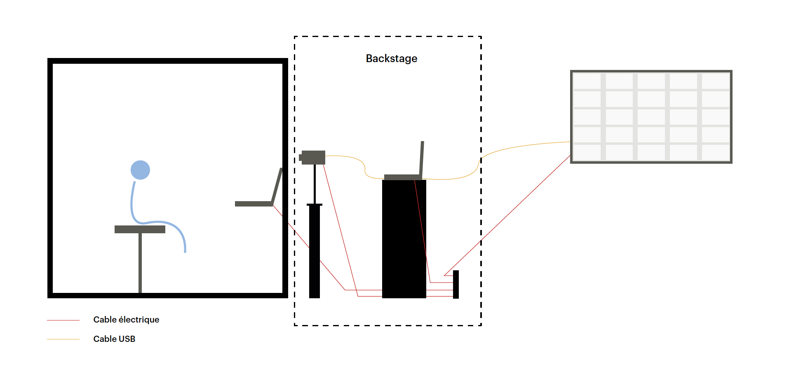
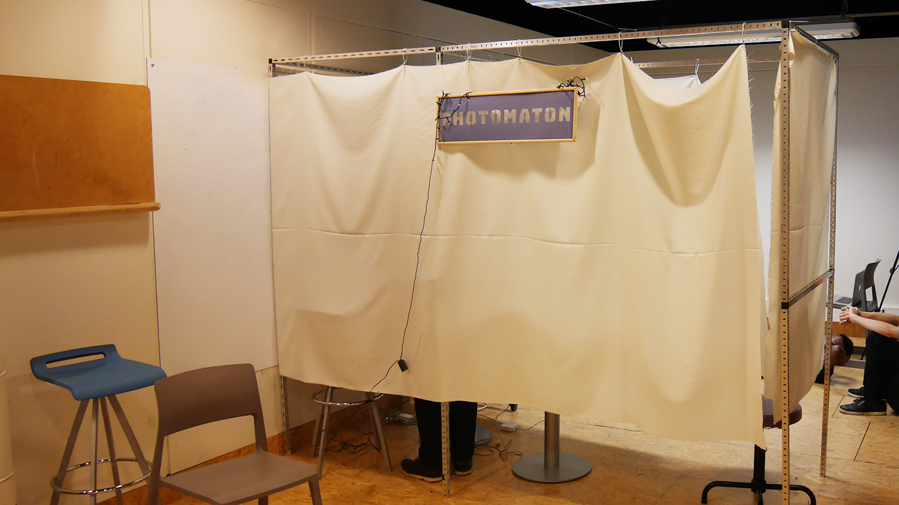
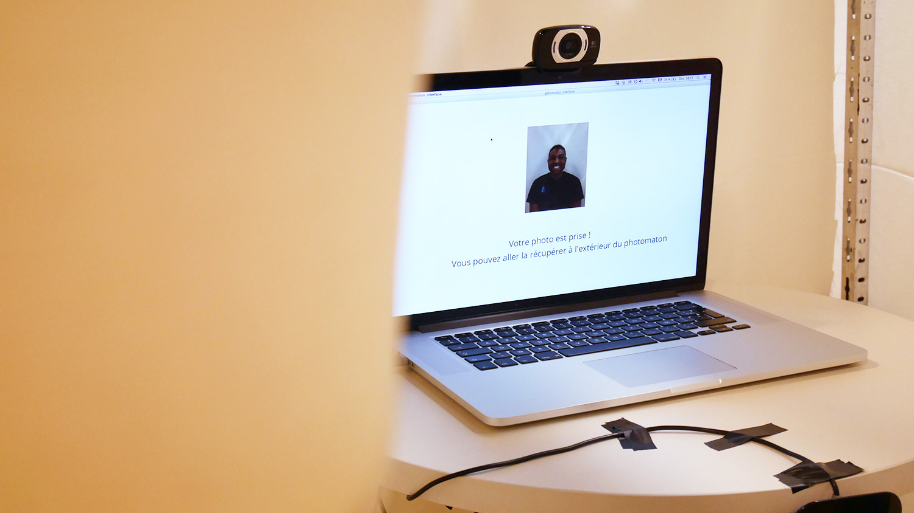
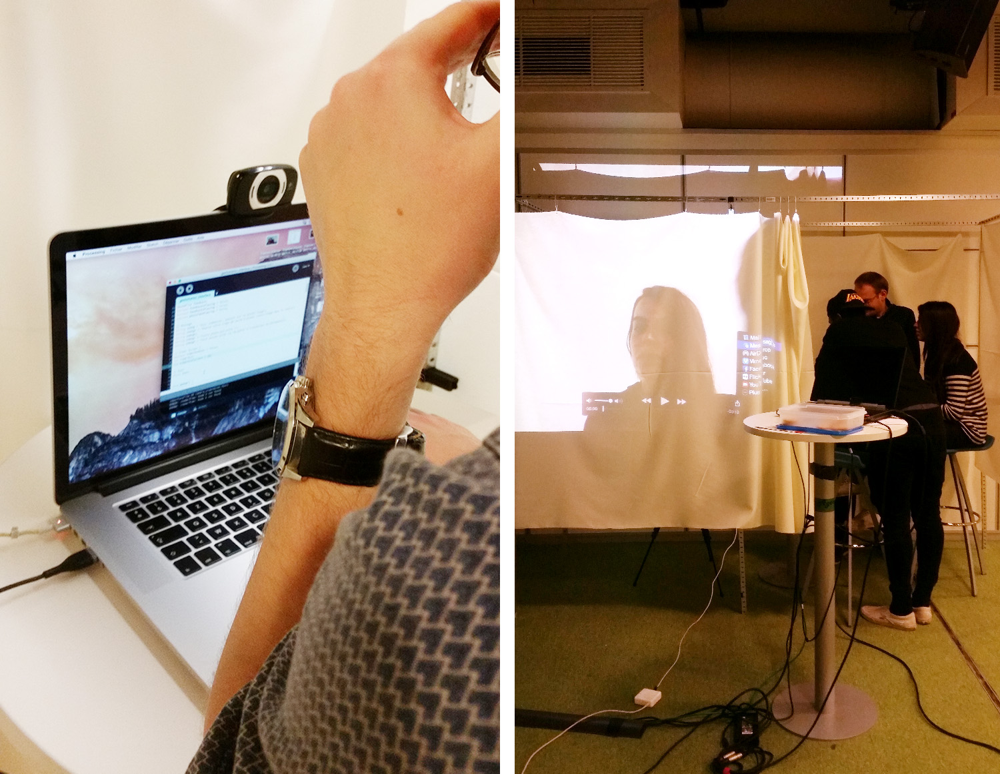
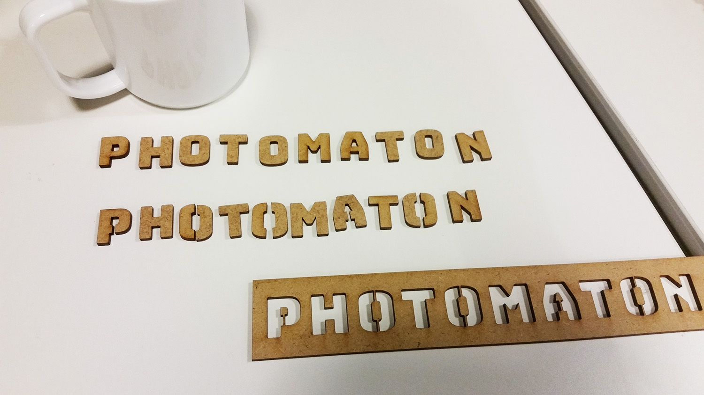

<!-- Main -->

<!-- One -->
<section id="one">
	

		<header class="major">
			<h1>Gestomaton</h1>
		</header>
		
Le Gestomaton est une installation dans laquelle le participant est invité à prendre une photo de son visage, comme dans un photomaton classique. Toutefois, le participant ne récupère pas sa photo à la fin mais découvre les gestes qu’il a effectué à l’intérieur de la cabine.

		<ol>
			<li><a href="#objectifs">Objectifs</a></li>
			<li><a href="#principe">Principe</a></li>
			<li><a href="#dispositif">Dispositif</a></li>
			<li><a href="#scenario">Scenario</a></li>
			<li><a href="#materiel">Matériel</a></li>
			<li><a href="#fabrication">Fabrication</a></li>
			<li><a href="#experimentation">Experimentation</a></li>
			<li><a href="#perspectives">Perspectives</a></li>
		</ol>

<!-- Content -->
<h2 id="objectifs">Objectifs</h2>

Nous faisons quantité de gestes au quotidien. Nombre d’entre eux ne sont pas « conscientisés » : nous les faisons de manière automatique, sans nous en rendre compte. Mais ces gestes font intimement partie de notre personnalité, de notre identité. Notre installation voulait remettre ces « micro-gestes » au centre de l’attention du public : nous voulions trouver une situation propice à l’observation de ces gestes.

<h2 id="principe">Principe</h2>

Nous avons retenu le principe du photomaton. En effet, avant de prendre la photo, nous effectuons un certain nombre de ces « micro-gestes » : nous réglons le siège, nous réajustons notre coiffure ou nos lunettes, nous bougeons notre tête pour ajuster sa position…

Par ailleurs, le photomaton repose aussi sur une procédure : l’utilisateur s’installe dans la cabine, choisit le type de photo qu’il veut faire, puis se prépare pour la photo et déclenche l’appareil. Il était donc intéressant d’étudier le degré de spontanéité des utilisateurs dans un dispositif aussi réglé.

Le photomaton était d’autant plus intéressant à étudier qu’il est à la frontière entre espace public et espace privé, lieu de passage et zone d’intimité. Comment alors se comporte t-on dans cet « entre-deux », de cette zone grise ? Et quelle influence sur les gestes ?

<h2 id="dispositif">Dispositif</h2>

L’idée était d’alors de reproduire au mieux l’expérience du photomaton, pour que les participants puissent s’y projeter et rester spontané dans leur gestuelle. L’idée était alors de créer une cabine, semblable à un vrai photomaton. La fin de l’expérience diffère toutefois légèrement : le participant s’attend à récupérer sa photo d’identité en sortant de la cabine, mais il découvre en réalité les gestes qu’il a effectué à l’intérieur du Gestomaton, au milieu de tous les autres gestes des précédents participants.

Pour cette première phase d’expérimentation, nous avons décidé de ne pas automatiser complètement l’installation : le participant actionne une interface fictive, destinée simplement à l’immerger dans l’expérience d’un photomaton classique. Les gestes de l’utilisateurs sont captées par vidéo : un technicien dissimulé à l’arrière de la cabine supervise l’enregistrement et l’affichage de la captation à la fin de l’expérience.

Schéma du dispositif

<h2 id="scenario">Scénario</h2>

Le participant est accueilli par un médiateur à l’entrée du Gestomaton : celui-ci lui explique l’objet de l’installation et son principe, en veillant à ne pas dévoiler la fin de l’expérience. Il informe le participant des modalités d’utilisation et lui demande son autorisation préalable pour la captation.

Le participant pénètre ensuite à l’intérieur de la cabine. L’écran de l’interface invite le participant à appuyer sur le bouton rouge de l’interface (touche espace du clavier) pour démarrer le processus de prise de vue. Un premier signal sonore retentit : il indique au technicien de démarrer l’enregistrement vidéo.

L’écran de l’interface annonce alors la prise de vue imminente. Le participant se préparer : il doit régler son siège et placer son visage dans le repère qui s’affiche sur l’écran. Un délai de 25 secondes s’écoule avant la prise de la photo : le temps restant s’affiche en temps réel sur l’écran. Cinq secondes avant la prise de vue, un second signal sonore retentit : il indique au technicien d’arrêter l’enregistrement vidéo.

Une fois la photo prise, le participant est invité à sortir de la cabine pour prétendument récupérer sa photo. Pendant ce temps, le technicien récupère le fichier de l’enregistrement vidéo, qu’il place ensuite dans la mosaïque.

Une fois sorti de la cabine, le participant est accueilli par un médiateur. Il lui explique la finalité de l’installation : le Gestomaton ne permet pas de prendre des photos d’identité, mais de révéler les gestes de ses utilisateurs. Le médiateur lui montre alors la mosaïque, qui affiche l’enregistrement vidéo de ses gestes, ainsi que ceux des précédents participants. C’est également un temps d’échange privilégié pendant lequel le médiateur peut répondre aux éventuelles questions du participant.

<h2 id="materiel">Matériel</h2>
<h3>Structure physique</h3>
<ul>
	<li>tasseaux metalliques</li>
	<li>toile</li>
	<li>colliers de serrage</li>
	<li>tabouret réglagble</li>
	<li>deux tables</li>
</ul>
<h3>Hardware</h3>
<ul>
	<li>deux ordinateurs portables</li>
	<li>deux webcams</li>
	<li>un moniteur</li>
	<li>un câble HDMI</li>
</ul>
<h3>Software</h3>
<ul>
	<li>Processing 3</li>
	<li>Safari, Chrome ou Firefox</li>
</ul>

<h2 id="fabrication">Fabrication</h2>
<h3>Structure physique</h3>

Nous avons commencé par construire une cabine, destinée à simuler un photomaton. La structure se compose de tasseaux métalliques, reliés entre eux par des connecteurs en plastique.

Il fallait ensuite isoler le cabine de son environnement et séparer l’espace du participant et celui du technicien. Pour ce faire, nous avons installé une toile, suspendue aux tasseaux à l’aide de colliers de serrage. À une extrémité de la cabine, la toile est ouverte de part et d’autre pour permettre au participant d’entrer et de sortir.

<h3>Interface</h3>

Le participant interagit donc par le biais d’un écran d’ordinateur et d’un clavier. La prise de vue est gérée grâce à une webcam.

L’ensemble permet de contrôler un programme développé en Java grâce au logiciel Processing. Ce programme autonome permet de contrôler l’interaction au clavier, l’affichage du retour webcam, le compte à rebours avant la prise de vue, la prise de vue et le déclenchement des deux signaux sonores.

<h3>Captation des gestes</h3>

Le technicien gère la captation des gestes du participant grâce à un ordinateur et une webcam déportée.

Sous Mac, la captation est effectuée grâce au logiciel QuickTime Player. Le technicien lance l’enregistrement via le menu Fichier > Nouvel enregistrement vidéo et sélectionne la webcam appropriée. Une fois l’enregistrement terminée, il exporte la vidéo dans un répertoire dédié. La nomenclature des fichiers doit suivre le modèle suivant : 01.mp4, 02.mp4, 03.mp4, ect.

<h3>Mosaïque</h3>

L’ensemble des gestes des visiteurs est exposé dans une mosaïque. Cette mosaïque est affichée à l’aide moniteur externe, disposé à l’extérieur de la cabine.

Cette mosaïque consiste en un fichier HTML, qui affiche les différentes vidéos. Les liens vers les différentes vidéos ont préalablement été rentrées dans le fichier : au fil des exports dans le répertoire dédié, les vidéos s’affichent alors dans la mosaïque.

<h2 id="experimentation">Expérimention</h2>

Cette installation a fait l’objet d’un test public le 10 décembre 2017 dans le Living Lab du Carrefour Numérique (Cité des Sciences et de l’Industrie).

Nous avons reçu au total six participants. Nous avons pu tester une configuration avec deux participants dans la cabine — nous n’avions pas prévu cette configuration initialement, mais elle semble fonctionner.

La partie du dispositif impliquant le participant a fonctionné correctement. La partie manuelle de l’installation (arrêt de l’enregistrement vidéo, export et actualisation de la mosaïque) a posé quelques problèmes, étant donné qu’elle devait se faire dans des temps très courts pour le technicien — les médiateurs à l’extérieur de la cabine devaient alors prendre le relai et occuper le participant quelques instants. Dans de rares cas, l’enregistrement des vidéos n’a pas fonctionné.

Ce test nous a permis néanmoins de réaliser que l’échange entre le médiateur et le participant était essentiel dans la compréhension des enjeux de l’installation. À ce titre, l’échange en fin d’expérience nous est appru particulièrement important : il permet aux médiateurs d’expliquer, contenus à l’appui, l’importance du geste et de faire preuve de pédagogie.

L’aspect relativement rudimentaire de l’installation obligeait le participant à faire un effort d’imagination. L’utilisation d’un véritable photomaton pourrait permettre une meilleure immersion. In fine, les gestes observés étaient influencés par la forme rudimentaire de l'installation: un photomaton plus réaliste aurait permis d'enregistrer et d'étudier des gestes plus naturels et réalistes.

<h2 id="perspectives">Perspectives</h2>

Une nouvelle version du Gestomaton pourrait permettre d’aboutir certains aspects de ce premier prototype. L’utilisation d’un véritable photomaton pourrait permettre une meilleure immersion du participant. En outre, il apparaît impératif d’automatiser complètement le processus de captation afin d’éviter les temps morts. La place du médiateur reste encore à affiner.
