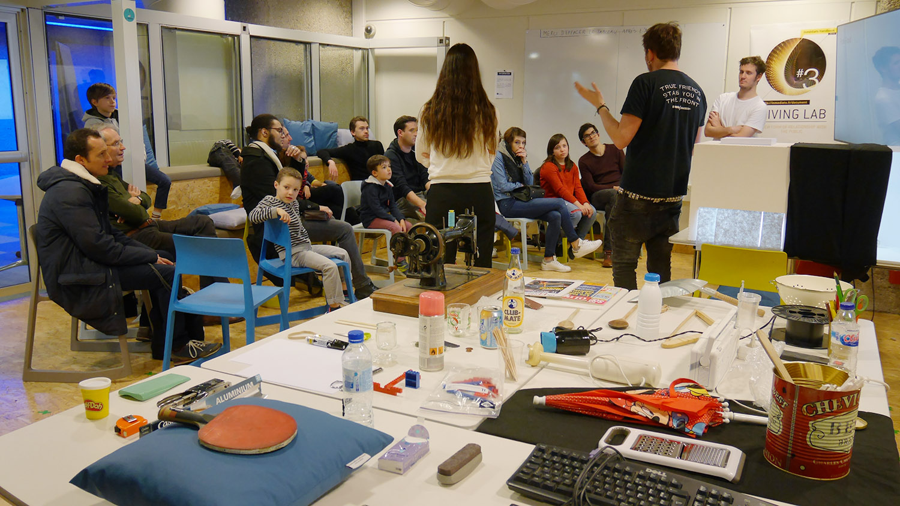
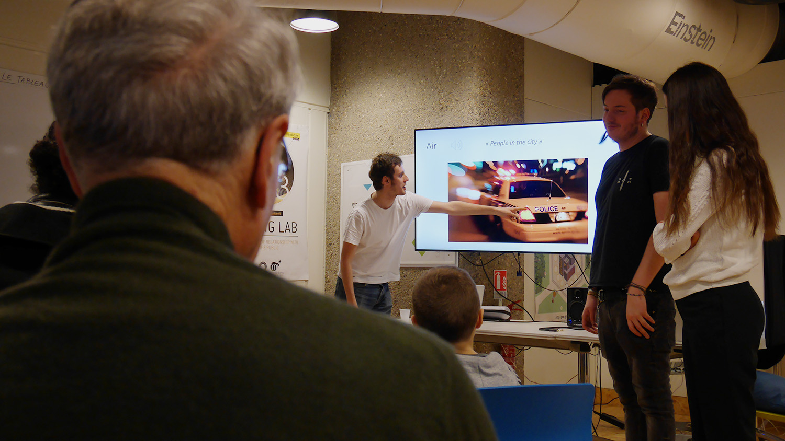
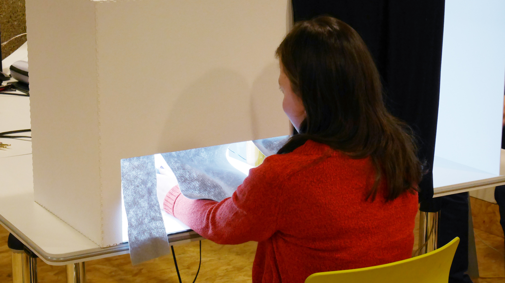
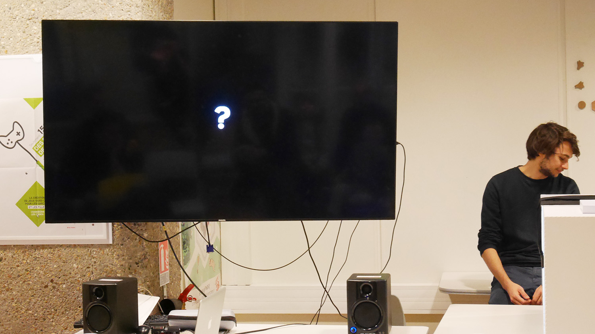
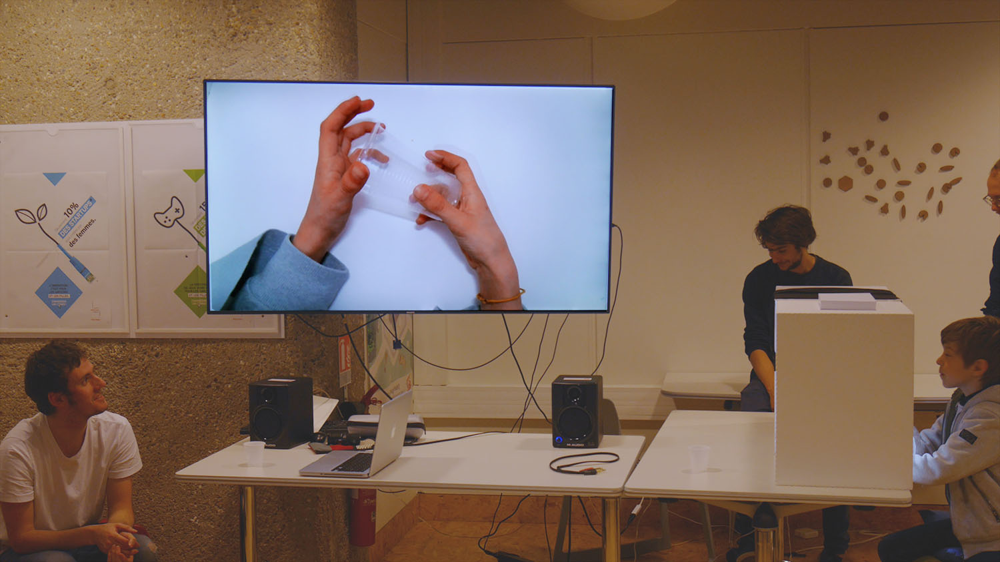
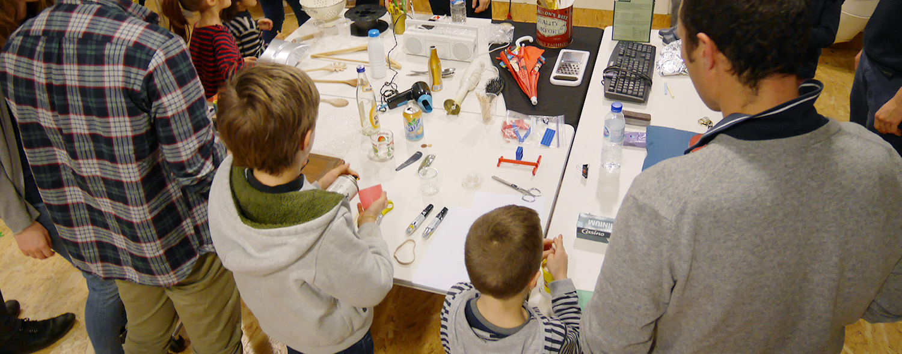
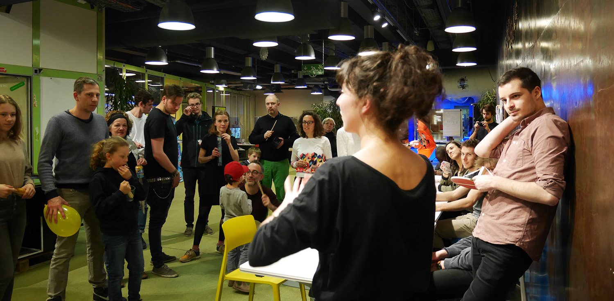

<!-- Main -->

<!-- One -->
<section id="one">
	

		<header class="major">
			<h1>L'objet comme instrument</h1>
		</header>
		
« L’objet comme instrument » est une série d’ateliers d'éveil musical qui propose au public une autre approche de la production musicale. Notre propos est d’expliquer que la musique n’est pas nécessairement produite à partir d’instruments de musique, mais qu’elle peut-être créée à partir d’objets du quotidien.

		<ol>
			<li><a href="#objectifs">Objectifs</a></li>
			<li><a href="#principe">Principe</a></li>
			<li><a href="#preparation">Preparation</a></li>
			<li><a href="#deroulement">Déroulement</a></li>
			<li><a href="#materiel">Matériel</a></li>
			<li><a href="#retours">Retours</a></li>
		</ol>

<!-- Content -->
<h2 id="objectifs">Objectifs</h2>

Pour une partie du public, la production musicale est un art inaccessible car elle suppose la pratique régulière d’un instrument de musique et requiert une certaine technicité. Pour autant, nous avons tous les moyens de produire de la musique. Nous pouvons utiliser des « objets du quotidien », c’est-à-dire des objets que l’on retrouve dans la plupart des foyers — objets de cuisine, électroménager, jouets, outils de bricolage… L’enjeu était également de créer une composition avec des qualités musicales, ce qui supposait d’amener le public à réfléchir sur notions (rythmique, harmonie, ect).

<h2 id="principe">Principe</h2>

Nous avons organisé des ateliers d’une heure environ pour sensibiliser le public à la production de musique à l’aide d’instruments du quotidien. Deux ateliers ont été organisés au Carrefour Numérique (Cité des Sciences et de l’Industrie) : le samedi 31 mars 2018 à 14h et 16h au Living Lab et deux autres le samedi 14 avril 2018 à 11h et 13h en Classe numérique. Ces ateliers comptaient 20 places maximum.

Ces ateliers se sont déroulés en deux grandes phases. Une première phase proposait une première approche historique, à travers la présentation de quelques exemples emblématiques de production de morceaux à l’aide d’objets du quotidien. Pendant la seconde phase, nous avons invité le public à manipuler directement les objets pour produire du son, puis pour assembler ces sons afin de créer des compositions.

Ces ateliers abordaient à la fois la question de la musique et du geste dans la production musicale. Ainsi, le groupe Accolab a préparé et animé ces ateliers avec la collaboration de Matthieu, Tom et Mariya, trois amis étudiants en Médiation de la musique à l’Université Paris III Sorbonne Nouvelle.

<h2 id="preparation">Préparation</h2>

Un premier rendez-vous avec Matthieu, Tom et Mariya en décembre 2017 nous a permis de lancer l’idée de ces ateliers et de proposer une première ébauche de leur déroulement.

Nous avons ensuite travaillé séparément sur les différents temps de l’atelier. Matthieu, Tom et Mariya ont préparé la première séquence, avec une introduction de la problématique de l’atelier et la présentation d’une quinzaine d’exemples historiques sous la forme d’un diaporama. De notre côté, notre étude autour du geste nous a conduit à penser les phases de manipulation et d’expérimentation avec le public : nous avons ainsi préparé la « Boîte à gestes » ainsi que la dernière phase de l’atelier, centrée sur la création d’une pièce sonore collective.

Une réunion de travail début mars nous a permis ensuite d’intégrer le travail de tous. Nous avons d’abord commencé par faire un filage de l’atelier, en répétant les différentes parties. Puis, un échange critique nous a permis ensuite de faire émerger des points à améliorer : le texte de l’introduction a ainsi été remanié et le nombre d’exemples réduit.

Les derniers jours avant l’atelier nous ont permis de réunir les objets utilisé pendant les phases d’expérimentation — nous avons récupéré des objets chez nous ainsi qu’au fablab du Carrefour Numérique.

<h2 id="deroulement">Déroulement</h2>

L’atelier commence par l’accueil et l’installation du public. Pendant ce moment, nous leur demandons s’ils acceptent d’être photographiés dans le cadre de la documentation du projet — le cas échéant, ils signent une autorisation de droit à l’image.

Le public est d’abord réuni devant un écran — quelques chaises ont été disposés devant pour qu’ils puissent s’installer. Au cours de son introduction, Matthieu explique que la production de musique ne se limite pas aux instruments de musique mais qu’elle peut se faire avec des objets du quotidien ; il fait également la distinction entre son et musique. Vient ensuite la présentation des exemples sous la forme d’un diaporama : Matthieu commence par faire écouter un morceau qui utilise un objet du quotidien, demande au public s’ils reconnaissent l’objet utilisé avant de le dévoiler — s’en suit une seconde écoute du son, cette fois-ci accompagné d’images. Tom et Mariya amènent tout au long de la présentation des compléments historiques.

La présentation de Matthieu s’achève sur la présentation de deux sons différents mais enregistrés avec le même objet (un verre d’eau). Cette explication lui permet d’expliquer l’importance du geste et d’introduire la suite de l’atelier.

La séquence suivante, animée par l’équipe d’Accolab, est centrée autour de la « Boite à gestes ». Nous introduisons des objets dans la boite et une personne du public, tour à tour, vient les manipuler pour produire un son. Les objets sont de tailles et de matières variées. Deux objets peuvent être introduits en même temps de la boite. Nous n’introduisons pas d’objets dangereux et veillons au choix des objets en fonction des participants — un objet plus petit et facile à manipuler pour un enfant, par exemple. Vient alors une phase interactive où les personnes du public qui pensent avoir trouvé l’objet lève la main et donne leur réponse. Si l’objet a été deviné, le retour caméra de la boite s’affiche alors dans l’écran. Puis, le participant regagne sa place après avoir remis l’objet deviné au médiateur.

La phase suivante fait se réunir le public autour d’une grande table où ont été disposés l’ensemble des objets à leur disposition. Pendant cinq à dix minutes, il doivent essayer de produire des sons en manipulant les objets. Le but est d’en essayer un maximum pour pouvoir choisir l’objet qui leur convient le mieux.

Vient enfin la dernière phase, celle du « chef d’orchestre ». Des groupes de dix participants environ sont constitués. Un chef d’orchestre est désigné pour mettre en action les participants et créer une composition. Avec ses mains, il peut décider de faire jouer ou non les différents membres de l’orchestre. Lever la main signifie que la personne désignée doit jouer de son instrument ; baisser la main signifie qu’elle doit s’arrêter de jouer. Deux mains dirigée vers un participant signifie que seul celui-ci doit jouer (un « solo ») ; lever les deux mains signifie que tout le monde doit jouer ; baisser les deux mains signifie que tout le monde doit s’arrêter de jouer. Pendant cette phase, nous enregistrons à l’aide d’un enregistreur numérique les compositions des participants. Deux à cinq chefs d’orchestre se succèdent pendant cette phase.

L’atelier s’achève sur la réécoute des composition des participant avec l’ensemble du groupe — cette composition peut-être envoyée aux participants par mail qui le souhaitent. Nous proposons enfin un moment d’échange autour d’une collation.

<h2 id="materiel">Matériel</h2>
<ul>
	<li>chaises</li>
	<li>tables</li>
	<li>un écran ou vidéoprojecteur</li>
	<li>un ordinateur</li>
	<li>LibreOffice Impress, PowerPoint ou Apple Keynote</li>
	<li>deux enceintes</li>
	<li>une boite à gestes</li>
	<li>une quarantaine d’objets du quotidien</li>
	<li>un enregistreur audio</li>
</ul>

<h2 id="retours">Retours</h2>

Nous avons reçu près de 40 participants pour les deux premiers ateliers et près de 30 participants pour les deux derniers ateliers. Il s’agissait en majorité de familles, essentiellement des parents venus avec leurs enfants.
