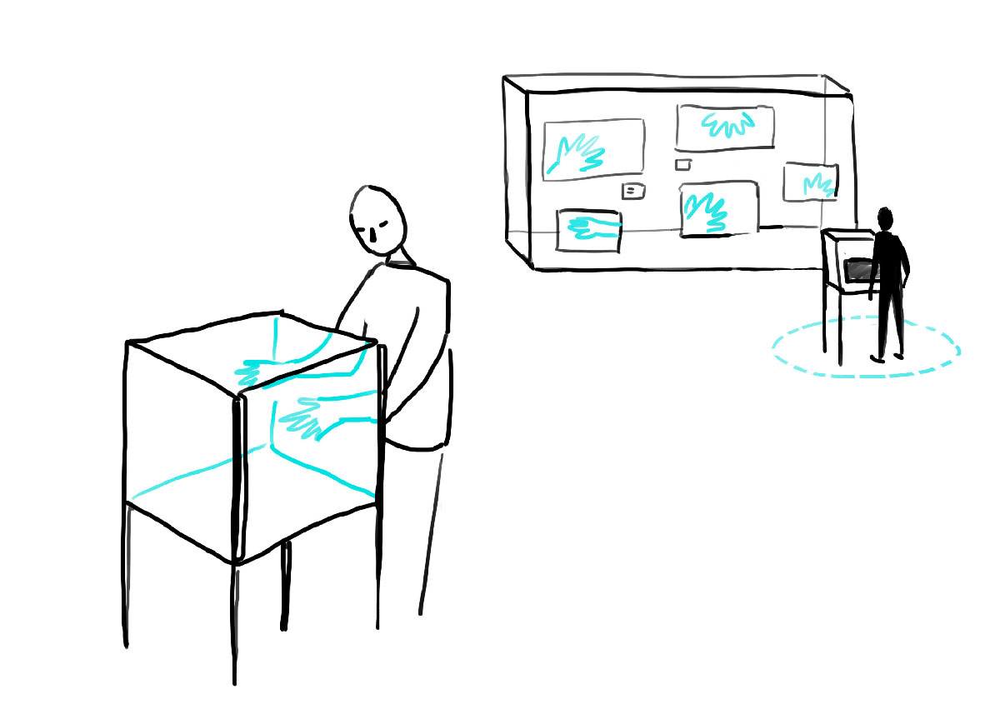
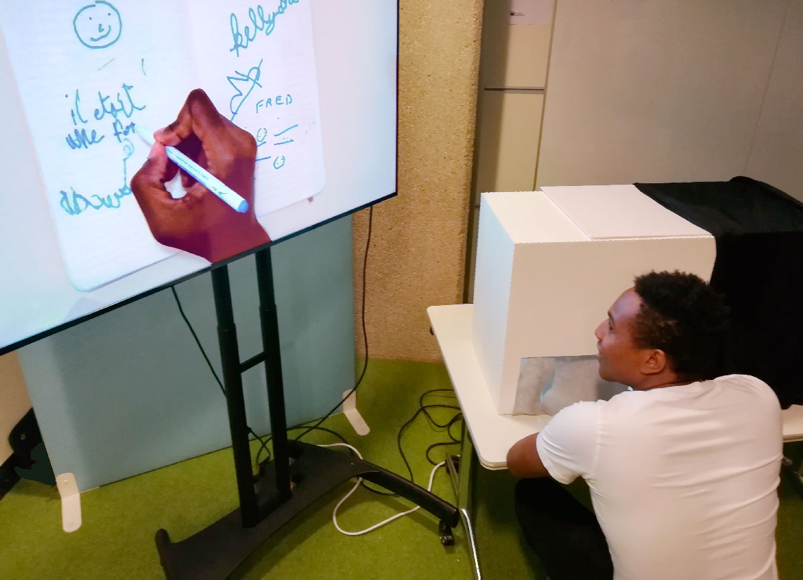
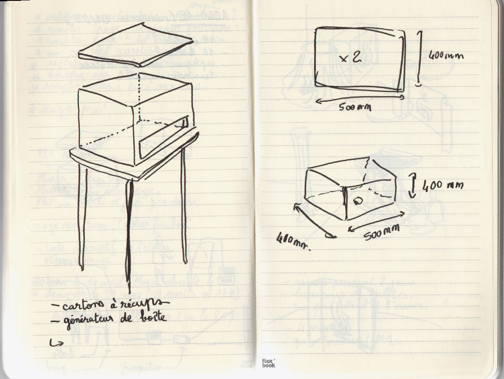
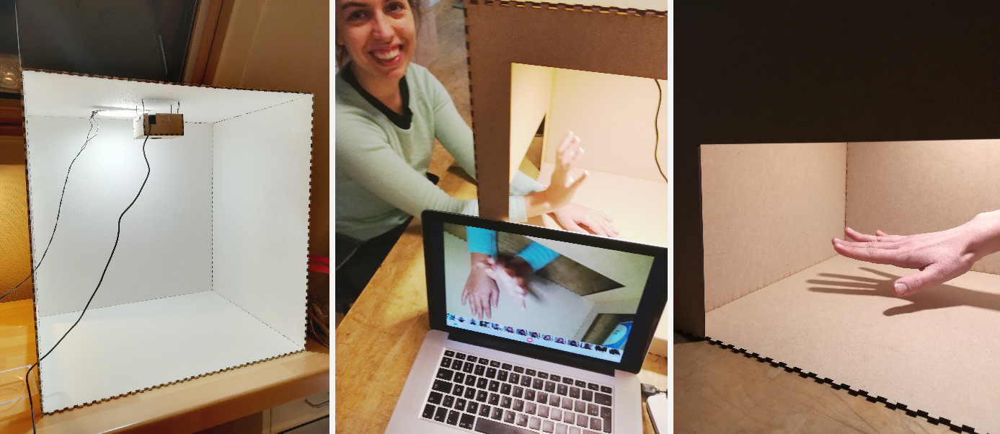

<!-- Main -->

<!-- One -->
<section id="one">
	

		<header class="major">
			<h1>La boîte à gestes</h1>
		</header>
		
La boîte à gestes est un outil simple d'enregistrement des gestes manuels. Les captures réalisées peuvent servir à l'archivage d'un geste, à son agrandissement sur un écran relié ou encore, à son amplification par des effets de ralenti ou d'écho.

		<ol>
			<li><a href="#objectifs">Objectifs</a></li>
			<li><a href="#dispositif">Dispositif</a></li>
			<li><a href="#scenario">Scenario</a></li>
			<li><a href="#materiel">Matériel</a></li>
			<li><a href="#fabrication">Fabrication</a></li>
			<li><a href="#test">Test public</a></li>
			<li><a href="#perspectives">Perspectives</a></li>
		</ol>

<!-- Content -->
<h2 id="objectifs">Objectifs</h2>

La boîte à gestes est un outil de captation vidéo qui se prête à différents usages. Comme un studio d'enregistrement de taille réduite, elle a d'abord été prototypée dans le but de permettre l'archivage de gestes manuels. Nous l'avons ensuite utilisé dans différents ateliers, pour amplifier et exposer le geste des participants.

Exemple d'utilisation : agrandir les gestes pour les montrer au public

<h2 id="dispositif">Dispositif</h2>

La boîte à gestes se compose d'une boîte en medium, d'une lampe led, d'un rideau de feutre, d'une webcam et d'un ordinateur équipé d'un logiciel d'enregistrement vidéo.

<h2 id="scenario">Scénario</h2>
<h3>Scénario n°1 : archiver et exposer le geste</h3>

La boîte à geste simplifie l'archivage du geste manuel, mais aussi, simplifie son exposition. Nous avons imaginé une vitrine connexe à la boîte et qui permet d'exposer tous les "objets gestuels" récoltés. Ce dispositif pourrait prendre place dans une salle d'exposition, et inviter le visiteur à gester autour d'une thématique comme les "gestes sonores", "l'écriture" ou encore, la manipulation d'un objet ancien.

Croquis de conception : les gestes apparaissent dans une vitrine après leur captation

<h3>Scénario n°2 : agrandir le geste</h3>

Dans le cadre de l'atelier "L'objet comme instrument", nous avons souhaité que les participants manipulent et fassent sonner des objets du quotidien sans les voir. Ces éléments seraient bientôt transformer en "objets sonores" pour en faire une création musicale collective. Mais avant cela, il nous a semblé intéressant de faire découvrir les objets par le toucher, par le son, puis de montrer l'image de la manipulation à l'ensemble du groupe réuni. L'apparition des mains sur un grand écran créait la surprise et l'intérêt, par le point de vue particulier que la webcam permet sur le geste et l'objet.

Exemple d'utilisation : agrandir les gestes pour les montrer au public

<h3>Scénario n°3 : troubler le geste</h3>

Dans le cadre d'un après-midi Living Lab (c'est à dire, avec la participation et les retours des visiteurs de la Cité des Sciences et de l'Industrie), nous avons expérimenté l'écriture dans la boîte à gestes. Écrire en voyant sa main à travers un écran s'avère difficile : le point de vue de la webcam rend trouble et l'écriture est déformée.

D'ailleurs, si vous souhaitez filmer vos mains entrain de tricoter, cuisiner ou écrire, nous vous expliquons comment fabriquer votre propre boîte à gestes !

Exemple d'utilisation : écrire dans la boîte à gestes

<h2 id="materiel">Matériel</h2>
<ul>
	<li>Trois planches de médium 3 mm et de dimensions maximum 1000 x 610 mm. Ces dimensions correspondent à la longeur et à la hauteur maximales permises par <a href="http://carrefour-numerique.cite-sciences.fr/fablab/wiki/doku.php?id=machines:decoupe_laser:reglages:speedy400">la découpeuse Speedy 400 du Fab Lab du Carrefour Numérique²</a></li>
	<li>une lampe led. Celle que nous avons utilisé est une lampe Leroy Merlin démontée et dont nous avons simplement gardé le bouton d'allumage, qui permet aussi de régler l'intensité lumineuse.</li>
	<li>une webcam (prévoir une rallonge USB si la câble est trop court) </li>
	<li>un ordinateur équipé d'un logiciel vidéo</li>
	<li>un pot de peinture blanche (2L)</li>
	<li>une bande de tissu en feutre de dimensions 200x420 cm</li>
</ul>

<h2 id="fabrication">Fabrication</h2>
<h3>Prototyper</h3>

Afin de filmer ce qui correspond aux avant-bras, nous avions besoin d'une hauteur d'environ 50 cm pour installer la webcam que nous avions choisi. Le champ de vision de la webcam correspondait à une largeur de 38 cm, ce qui détermina la profondeur de la boîte. Enfin, nous avons fait le choix de placer une ouverture de 18 cm en bas de la boîte pour pouvoir avancer confortablement les avant-bras, puis de laisser une face accessible pour pouvoir filmer sur le côté ou placer des objets dans la boîte.

<h3>Fabriquer</h3>

Une fois les dimensions de la boîte choisies (500x380x500mm), il s'agit de générer les fichiers svg qui serviront à la découpe de la boîte. Pour cela, le merveilleux <a href="http://carrefour-numerique.cite-sciences.fr/fablab/wiki/doku.php?id=projets:generateur_de_boites">générateur de boîte du Carrefour Numérique</a> nous sera utile. Enfin, une ouverture a été ajoutée sur un côté de la boîte, afin de pouvoir accéder plus facilement à l'intérieur du studio.

Croquis de conception

<a href="assets/files/plan_boite.svg" class="button icon fa-download">Fichiers de découpe de la boîte</a>

Afin de fixer la webcam, nous avons aussi fabriqué une petite boîte sur mesure. Cet élément est suspendu à l'intérieur du bloc à l'aide de quatre petits trous et de deux fils de fer, ce qui nous permettra de l'orienter par la suite.

Toutes les pièces de la boîte à gestes ont été peintes en blanc afin de mieux refléter la lumière à intérieure. La lampe led est fixée avec du scotch double-face sur la face intérieure haute de la boîte et le rideau en feutre, fendu à deux endroits a été fixé avec de la glue.

Fabrication et premier test au fablab du Carrefour Numérique

<h2 id="test">Test public</h2>

Les différents scénarios décrits plus hauts ont été testés avec les visiteurs du Carrefour Numérique² de la Cité des Sciences et de l'Industrie.

<h2 id="perspectives">Perspectives</h2>

Pour qu'un utilisateur de la boîte puisse plus facilement observer ses gestes à l'écran, la boîte aurait pu être moins haute et permettre de regarder au-dessus. Or, pour que la webcam filme à une distance intéressante, il fallait que la hauteur du bloc soit de 50 cm... dommage !

Pour des cas comme l'atelier "L'objet comme instrument", il aurait été plus facile d'avoir une extension de la boîte, afin de pouvoir glisser les objets que nous faisions manipuler aux personnes. Peut-être un ajout à réaliser !
