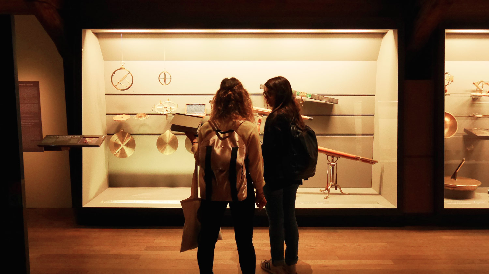
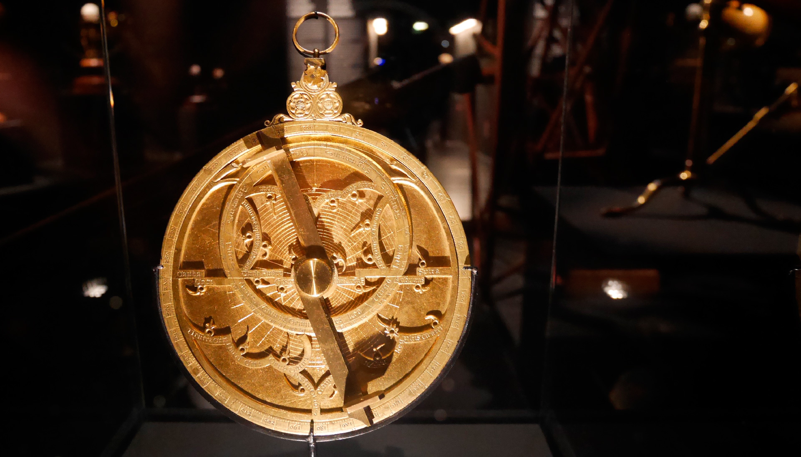
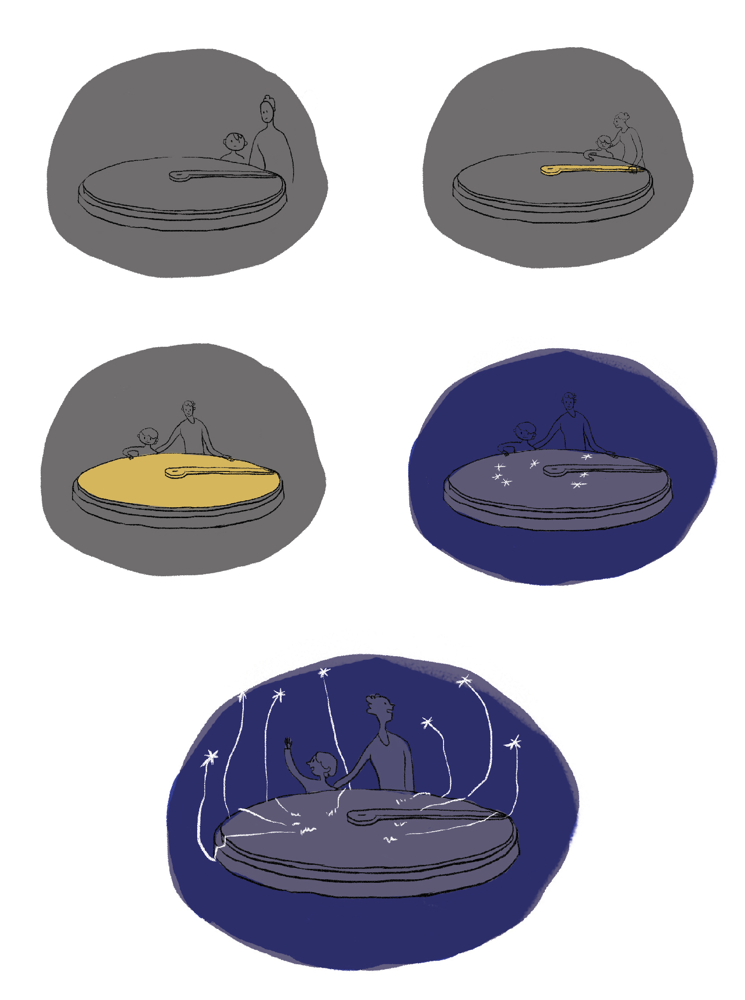
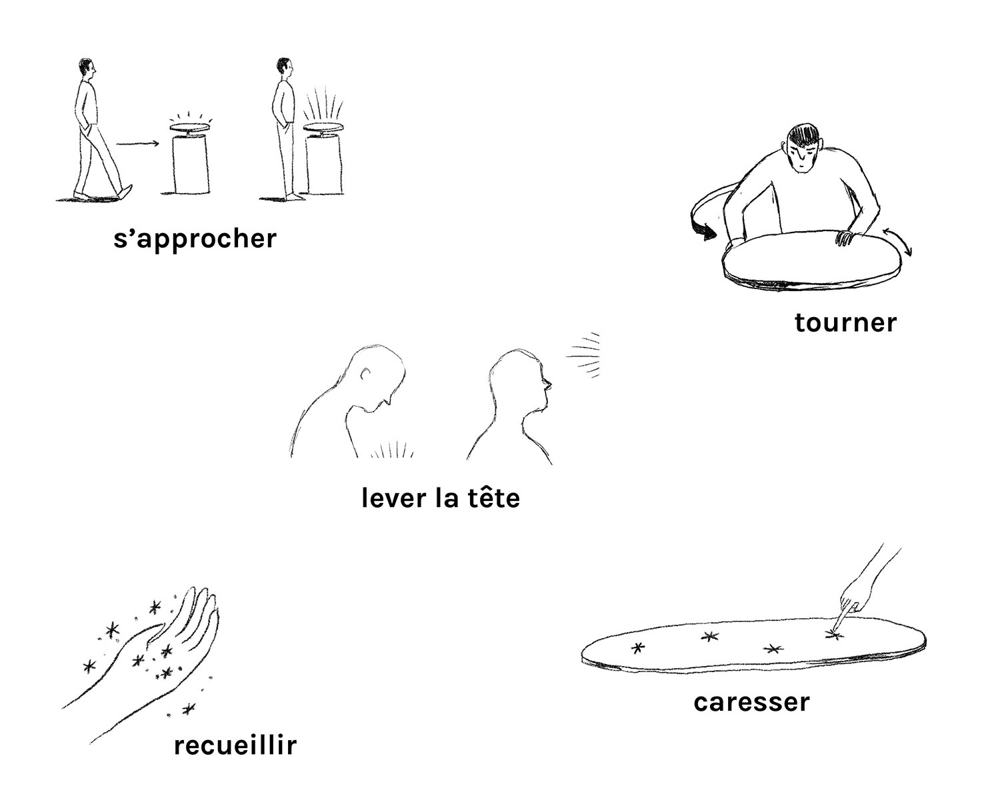
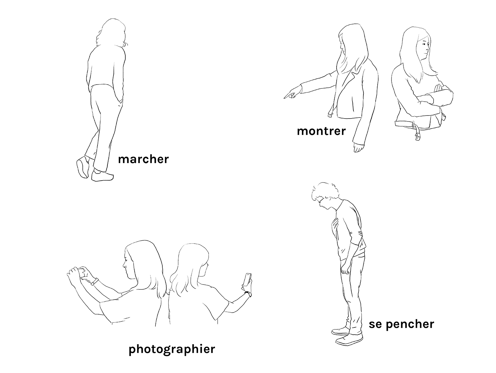
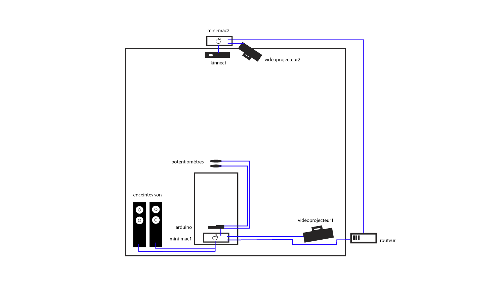
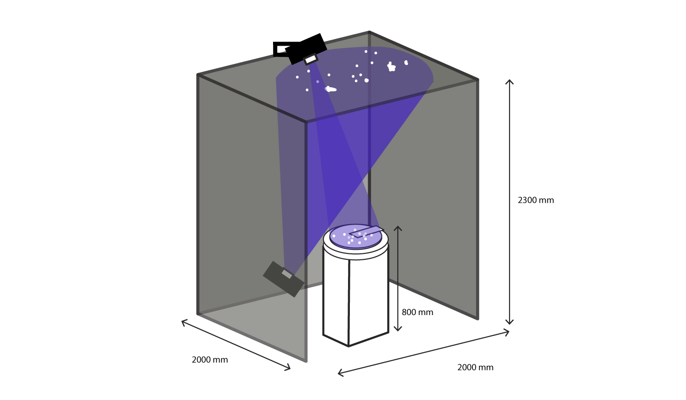
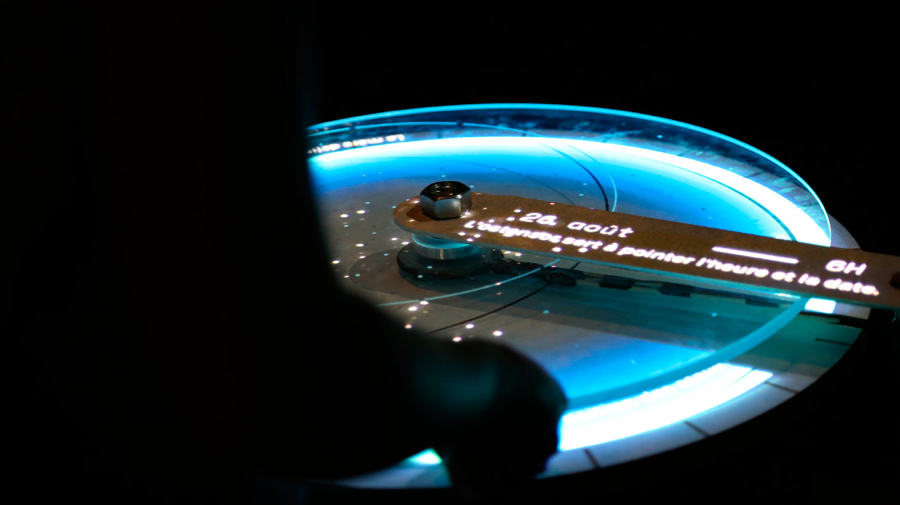

<!-- Main -->

<!-- One -->
<section id="one">
	

		<header class="major">
			<h1>Mélothésie</h1>
		</header>
		<ol>
			<li><a href="#recherches">Recherches</a></li>
			<li><a href="#objectifs">Objectifs</a></li>
			<li><a href="#scenario">Scénario d'usage</a></li>
			<li><a href="#methodologie">Méthodologie</a></li>
			<li><a href="#dispositif">Dispositif</a></li>
			<li><a href="#fabrication">Fabrication</a></li>
			<li><a href="#test">Test public</a></li>
		</ol>

<!-- Content -->
<h2 id="recherches">Recherches</h2>

Musée des Arts et Métiers

Dans un musée, on s’est tous déjà retrouvés face à cet écriteau. "Do not touch". C’est du bon sens, c’est normal qu’on ne puisse pas toucher certaines oeuvres d’arts, ou certains objets : en les touchant, on risque de les abîmer. Mais parfois, il arrive que la présence de schémas, de cartels, de vidéos ne soit pas suffisants à comprendre un objet exposé. Seule la manipulation permettrait cela. Comment faire pour que le visiteur puisse manipuler et comprendre ces objets « intouchables » ?

Le projet « Mélothésie » est né de notre collaboration* avec le Musée des Arts et Métiers. Nous leur avons proposé une nouvelle forme de médiation d’un objet par le geste : avec eux, nous avons choisi l’astrolabe.

* Ce projet a été réalisé par Clara Lanthiez, Tallulah Frappier et Coralie Retureau dans le cadre de leur projet de diplôme pour l'école Estienne.

<h2 id="objectifs">Objectifs</h2>

Astrolabe exposé au Musée des Arts et Métiers

L’astrolabe est un instrument de mesure du temps qui s’utilise avec le ciel et les étoiles. Il permet tout à la fois de connaître l'heure et la date en fonction de la position d'une étoile, de mesurer des distances hors de portée, de connaître la position du ciel à une date et une heure données... Cet objet fascine autant par sa beauté que par sa complexité. Avec "Mélothésie", nous avons souhaité aider les visiteurs du musée à comprendre l'astrolabe par le geste et la manipulation. L'objet augmenté par la vidéoprojection guide l'utilisation et enrichie l'expérience de l'objet.

<h2 id="scenario">Scénario d'usage</h2>

Croquis de Tallulah Frappier

Partant de notre analyse, nous avons imaginé un dispositif qui reprend un des geste principaux que les personnes ont intuitivement avec l'astrolabe : celui de faire tourner les différentes parties de l'objet. En réalité, ce mouvement de rotation correspond à celui des étoiles autour de l'étoile polaire. Ainsi, faire tourner le ciel étoilé en même temps que l'on tourne les différentes parties de l'astrolabe nous semblait être une piste à suivre pour faire comprendre la relation entre l'objet et la voute céleste. En comprenant cette relation avec ses sens et ses gestes, c'est une forme médiation autonome et intuitive que nous proposons.

Croquis de Tallulah Frappier

<h2 id="methodologie">Méthodologie</h2>

Nous avons commencé par observer les gestes des visiteurs du musée. Une première visite avec une médiatrice du musée et un groupe de scolaire a confirmé notre intérêt pour la découverte manuelle d'un objet comme l'astrolabe. Après cela, nous avons demandé à une quinzaine de personnes d'essayer de comprendre l'utilisation et la fonction de l'astrolabe, sans le connaître et sans informations préalables. Certains gestes étaient récurrants : celui de le suspendre par l'anneau, celui de tourner les différentes parties amovibles et celui de caresser les gravures pour essayer d'en comprendre le sens.

Personne découvrant l'astrolabe

<h2 id="dispositif">Dispositif</h2>

Le dispositif se compose d'une cabine en tasseaux métaliques recouverte d'un tulle noir ignifugé, de deux vidéoprojecteurs, d'un serveur NAS, de deux ordinateurs (mac mini), d'une caméra Kinect, de composantes arduino (carte et potentiomètres plats), d'un artefact d'astrolabe (mère, araignée et ostensor) et d'un meuble sous celui-ci, afin de stocker ordinateurs et capteurs.

Schéma du dispositif

<h2 id="fabrication">Fabrication</h2>

Le pupitre qui soutient l'astrolabe se compose d'une porte pour permettre d'accéder plus facilement au matériel et d'un trou sur le haut. Dans cette ouverture, nous avons passé la tige filetée autour de laquelle l'astrolabe pourrait tourner. La tige est fixée à l'aide d'écrous de chaque coté de la planche de bois.

L'astrolabe en soi se compose de trois parties. Il y a l'araignée, sur laquelle les étoiles sont gravées. Nous avons choisi de la réaliser en pmma transparent, d'une épaisseur de 8 mm. Sur le bord de l'araignée, on peut lire les mois de l'année. Il y ensuite la mère, sur laquelle les heures sont indiquées. Enfin, l'ostensor sert de tête de lecture dans l'astrolabe. Nous nous en servirons pour projeter des informations textuelles.

Schéma de l'astrolabe / schéma de notre artefact

Pour les faire tourner plus facilement, des roulements à billes sont encastrés dans les pièces amovibles (la mère et l'araignée). Ces roulements à billes nous serviront aussi pour indiquer à l'ordinateur la vitesse de rotation des différentes parties. En effet, une petite pièce métalique entre en contact avec un potentiomèter situé juste en dessous et indique, via la carte arduino, l'angle de rotationd de la mère ou de l'araignée. Les deux potentiomètres sont fixés sur une pièce en médium spécialement découpée pour le dispositif.

Pour la structure, nous avons utilisé des tasseaux métaliques dédiés au montage de ce type de structure. Les tulles noirs ont été cousu directement sur la structure, pour plus de solidité.

Pour ce qui est de la vidéoprojection, un programme que nous avons réalisé sur le logiciel Processing permet de synchronisé les vidéoprojections avec les mouvements de l'utilisateur. Lorsque l'araignée ou la mère tournent, le ciel tourne. Un texte s'affiche sur l'ostensor pour expliquer la nature des différentes parties.

Enfin, la caméra Kinect est reliée à un second programme Processing qui permet de détecter les mouvements des mains au-dessus de l'astrolabe. Des étoiles générées par le logiciel suivront les mouvements des mains de l'utilisateur. Car tenir l'astrolabe, c'est un peu avoir le ciel étoilé entre ses mains !

<a href="assets/files/ciel.png" class="button icon fa-download">Image projetée</a>

Les images ont été produites par nos soins, comme la voute que vous pouvez téléchargé ci-dessus.

<h2 id="test">Test public</h2>

Nous avons testé Mélothésie avec les visiteurs du Musée des arts et métiers le Dimanche 4 juin 2017.

Nous avons constaté que l'interactivité et l'aspect expérientiel rendent curieux. De nombreux visiteurs du musée ont souhaité testé l'installation. En outre, et malgré les indications textuelles et nos tentatives de rendre l'objet le plus intuitif possible, la présence d'un-e médiateur-trice était requise. Nous avons joué ce rôle pendant la séance. Enfin, certains thermes ont été ma compris, comme le mot "mère" : confondu avec son homophone "mer", l'univers bleuté de Mélothésie aura certainement participé de cela.

Différentes améliorations ont été apporté pour une seconde présentation de Mélothésie, à la fin du mois de Juin 2017.

Vidéo du premier test utilisateur

