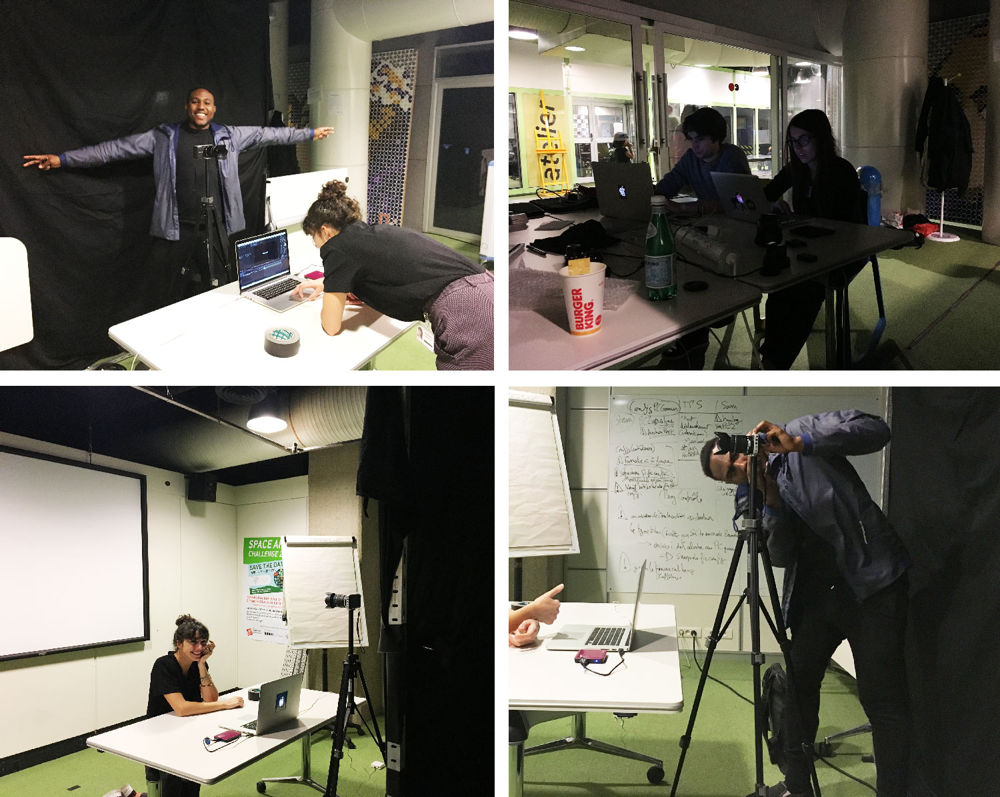

<!-- Main -->

<!-- One -->
<section id="one">
    

        <header class="major">
            <h1>Mime-moi une fusée</h1>
        </header>
        
Mime-moi une fusée est une installation dans laquelle le participant est invité à mimer les mots qui lui sont suggérés. Un dispositif de captation permet d’enregistrer puis de sauvegarder ces gestes dans une base de données.

        <ol>
            <li><a href="#objectifs">Objectifs</a></li>
            <li><a href="#principe">Principe</a></li>
            <li><a href="#dispositif">Dispositif</a></li>
            <li><a href="#scenario">Scenario</a></li>
            <li><a href="#materiel">Matériel</a></li>
            <li><a href="#fabrication">Fabrication</a></li>
            <li><a href="#experimentation">Experimentation</a></li>
            <li><a href="#perspectives">Perspectives</a></li>
        </ol>

<!-- Content -->
<h2 id="objectifs">Objectifs</h2>

Nous avons tous déjà joué à « Dessiner, c’est gagné ! » ou au « Time’s up ». Le but de ces jeux est simple : faire deviner un mot à quelqu’un en le mimant. Pour autant, les choses peuvent varier d’un joueur à un autre : nous avons chacun une façon de nous représenter certains objets ou concepts ; notre gestuelle elle-même nous est propre. L’installation Mime-moi une fusée souhaitait montrer, sous une forme ludique, que nos gestes disent finalement certaines choses de notre personnalité.

<h2 id="principe">Principe</h2>

Cette installation s’appuie sur un principe relativement simple : traduire des mots en mimes. Son principe est compréhensible par le plus grand nombre (y compris par les plus jeunes) et il ne demande aucun matériel particulier, si ce n’est un support pour les mots à mimer et son propre corps. Nous souhaitions donc un dispositif qui soit aussi transparent dans sa mise en place que dans son principe : une scénographie dépouillée, facile à prendre en main et qui invite le spectateur à participer très spontanément à l’expérience.

Pour certains participants, cette installation peut être déstabilisante : il n’est pas forcément évident de s’exprimer par le corps, qui plus est devant une caméra — peur d’être maladroit dans ses gestes, de se sentir ridicule, ect. Il nous semblait donc important de « rassurer » autant que possible le spectateur en créant une forme d’intimité : libéré du regard d’éventuels spectateurs, le participant peut librement s’exprimer.

<h2 id="dispositif">Dispositif</h2>

Au préalable, il s’agit de préparer la liste des mots qui seront proposés au participant. Nous avons fait le choix d’assembler ces mots sous la forme d’une vidéo, qui peut être produite à l’aide d’un logiciel de montage (Premiere, Final Cut Pro, iMovie, Windows Movie Maker) ou d’effets spéciaux (Motion, After Effects). La durée d’affichage des mots peut être est laissée à l’appréciation des organisateurs. Il est toutefois préférable de ne pas descendre en dessous de dix secondes par mot et de conserver la même durée d’affichage pour tous les mots pendant une session. Une indication visuelle (jauge, décompte) peut indiquer au participant le temps qui lui reste pour mimer le mot.

Le dispositif prend place dans une pièce close, ou relativement fermée, pour créer un peu d’intimité..

Au fond de cette pièce, une caméra installée sur trépied capte les gestes du participant ; au pied de cette caméra, un écran permet l’affichage des mots. Le participant se place juste en face de ce dispositif — un repère peut être posé au sol à cet effet.

La caméra doit, de préférence, être réglée de sorte à filmer le participant en plan américain, afin de pouvoir capter les mouvements de la majeure partie du corps — tête, épaules, bras, mains, torse, bassin.

L’installation est semi-automatisée : un technicien doit déclencher l’enregistrement de la caméra et l’affichage des mots. Ces mots peuvent ensuite défiler automatiquement sous la forme d’une vidéo.

<h2 id="scenario">Scénario</h2>

Le participant est accueilli par un médiateur à l’entrée de l’installation : celui-ci lui explique l’objet de l’installation et son principe. Il informe le participant des modalités d’utilisation et lui demande son autorisation préalable pour la captation.

Le participant prend place dans l’installation. Le médiateur déclenche l’enregistrement de la caméra et lance l’affichage des mots. Les différents mots s’enchaînent : à chaque fois, le participant doit le mimer.

À l’issue de la session, le participant est invité à sortir du dispositif. Le médiateur arrête l’enregistrement de la caméra. C’est également un temps d’échange : le médiateur peut répondre aux éventuelles questions du participant.

<h2 id="materiel">Matériel</h2>
<h3>Structure physique</h3>
<ul>
    <li>une petite table</li>
</ul>
<h3>Hardware</h3>
<ul>
    <li>un ordinateur portable</li>
    <li>une caméra (webcam, camescope ou appareil photo)</li>
    <li>un trépied</li>
</ul>
<h3>Software</h3>
<ul>
    <li>un logiciel de montage</li>
    <li>VLC</li>
</ul>

<h2 id="fabrication">Fabrication</h2>

Pour l’affichage des mots, nous avons privilégié une mise en page très simple, qui favorise la lisibilité : typographie sans empattements, texte en blanc sur fond noir.

<h3>Interface</h3>

Le participant interagit donc par le biais d’un écran d’ordinateur et d’un clavier. La prise de vue est gérée grâce à une webcam.

<h2 id="experimentation">Expérimention</h2>

Cette installation a fait l’objet d’un test public le 10 décembre 2017 dans le Living Lab du Carrefour Numérique (Cité des Sciences et de l’Industrie).

Cette installation a été proposée à des participants qui venaient de tester le Gestomaton : c’est un point important car ils étaient déjà confrontés à la problématique du geste et avaient déjà testé une installation qui impliquaient leur corps. Certains participants étaient très enthousiastes à l’idée de participer à Mime-moi une fusée, ce qui révèle le caractère ludique de l’installation. Pour d’autres en revanche, l’idée de devoir s’exprimer par le mime était rédhibitoire.

Nous avons noté que s’il était difficile pour certains de mimer des mots en face d’un public, il leur était beaucoup plus facile de le faire devant une caméra — le contact avec le spectateur est « indirect », puisque les captations sont visionnées après l’expérience.

Sur le plan technique, l’installation n’a posé aucun problème particulier. Nous avons pu laisser les participants en autonomie sans soucis. Contrairement au Gestomaton, les contacts avec le(s) médiateur(s) sont plus réduits : le participant est laissé seul pendant le déroulement de l’installation et il est moins nécessaire de décrypter les enjeux de l’installation à l’issue de l’expérience.

<h2 id="perspectives">Perspectives</h2>

La mécanique, déjà éprouvée, fonctionne bien et ne semble pas devoir être modifiée. L’installation est néanmoins assez « froide » dans son exécution : le dispositif est réduit à l’essentiel, le matériel est montré à nu, il n’y a pas de décor… À l’évidence, il s’agirait d’affirmer un univers visuel plus marqué pour une éventuelle V2. L’utilisation de la base de données de mimes doit être précisée.

L’affichage des mots pourrait être rendu plus efficace d’un point de vue logistique. On pourrait imaginer un programme (codé sur Processing, par exemple) qui afficherait les mots répertoriés dans une base de données : il serait ainsi plus simple d’ajouter ou de supprimer des mots, de modifier le temps d’affichage, ect.
